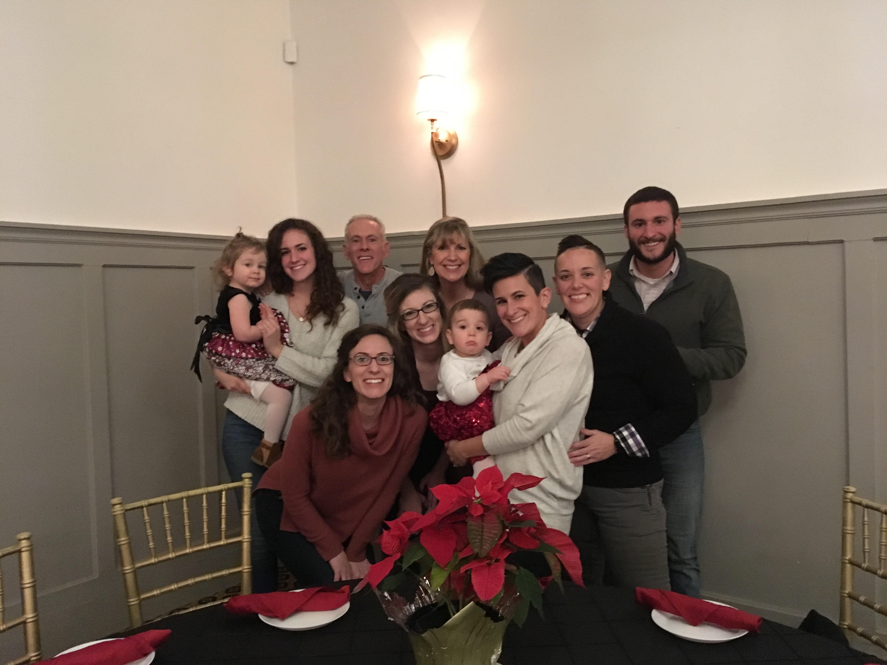

---

title: About Me
---

## About Me

Hi! I am Amanda Sheehan, I am a senior at Kent State University studying Computer Information Systems with a minor of Computer Science. I have a strong interest in healthcare, as I started my college experience as a nursing major. I am still excited to pursue different ways of helping others with technology and health science. In the future, I hope to move somewhere warm (I have lived near Cleveland, Ohio my entire life), stay connected with my family, and help serve underpriviledged women.

### Hobbies & Interests
In my free time away from school and work, I love lifting weights and doing yoga! I believe that getting up and moving helps me to get out of my head and produce stronger work, and it also helps me feel my best. Occasionally I also enjoy playing casual volleyball with friends (I tend to be a bit coordinationally challenged).  
I also enjoy reading (or listening to audiobooks if I do not have time to sit down). My favorite book that I have read lately is *All the Light We Cannot See* (Anthony Doerr), I am currently reading *The Fountainhead* (Ayn Rand), and the next books I want to read are *To Love and Let Go* (Rachel Brathen) and *Be Here Now* (Ram Das).  
My favorite thing to do in my free time, however, is to spend time with my family. I have three sisters, a brother, and two nieces. My family is extremely important to me, and being able to spend time with them keeps me in check with what is important. 

## Education
I will be gradutating in May 2020 from Kent State University with a degree in Computer Information Systems and a minor in Computer Science. I participated in the Honors program to complete this degree with Honors and currently have a 3.9 GPA. My technical skills include experience with:  
* Python
* C++/C#
* SQL
* JavaScript/CSS/HTML
* VMware Certified Associate (August 2019)

### Learn More
To learn more about me connect with me on <a href="https://www.linkedin.com/in/amanda-sheehan-a2254b14a/" target="_blank">LinkedIn</a>, review my projects on <a href="site.github.sheehanab" target="_blank">GitHub</a>, or contact me at [asheeha3@kent.edu](mailto:asheeha3@kent.edu).

